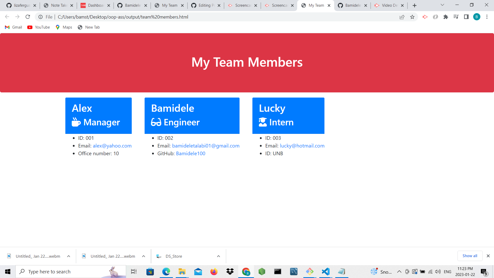

# Team-Profile-Generator

#Team Profile Generator Using Object-Oriented Programming

The appilcation is designed to generate an HTML page for employees of a company. It works in such a way of collecting employee's names, Indentication numbers, email addresses and office numbers through input prompts using visual studio code together with node.js to run in a terminal, inquirer for prompts, jest to test the application's functionality. 

After the generated HTML page, the user will see the page based on the information typed in when prompted in the terminal. When a link is clicked (email) on the page, the user will be taken to the link.

## Generated images

![alt text](./images/image2.png

© 2023 Bamidele Talabi. Confidential and Proprietary. All Rights Reserved

